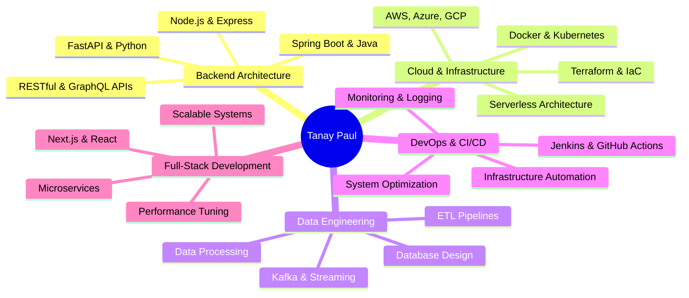

  

  
  

  <!-- Social Badges -->
  

    
    
    
    
    
    
  

  <!-- Views & Followers -->
  

    
    
    
  

---

## 🚀 About Me  
- Backend Engineer specializing in **scalable distributed systems**  
- Building **cloud-native applications** and **data pipelines**  
- Passionate about **system design**, **DevOps**, and **infrastructure automation**  
- All of my work is **open-source**  
- Reach me via: *Tanay Paul*  
- Fun fact: I debug production issues faster than I choose food 🍔💻  

---

### 🎯 What I'm Building

* 🔥 Production-grade APIs with **Spring Boot, Node.js & FastAPI**
* ☁️ Cloud-native architectures on **AWS, Azure & GCP**
* 🔧 Scalable **data pipelines** and **ETL workflows**
* 🐳 Containerized deployments with **Docker & Kubernetes**
* 🚀 **CI/CD pipelines** and infrastructure automation
* 🌐 Full-stack systems with **Next.js + React**
* 🤖 Occasionally dabble in **ML model integration**

---

## 🛠️ Tech Stack & Tools

### Backend & Languages

<!-- Programming Languages & Backend Frameworks -->

---

### Frontend & Full-Stack

---

### Cloud & Infrastructure

---

### Databases & Data

---

### DevOps & Tools

---

### Additional Tools

---

### Machine Learning (Occasional)

  
  

---

## 📊 GitHub Stats Dashboard

  
  

   

---

---

## 🏆 GitHub Trophies

  

---

## 🐍 Contribution Snake (Dark/Light Mode)

  <picture>
    <source media="(prefers-color-scheme: dark)" srcset="https://raw.githubusercontent.com/platane/snk/output/github-contribution-grid-snake-dark.svg" />
    <source media="(prefers-color-scheme: light)" srcset="https://raw.githubusercontent.com/platane/snk/output/github-contribution-grid-snake.svg" />
    
  </picture>

---

## 🚀 Skills Matrix

---

## 🌱 Currently Mastering

| Skill                    | Progress | Target                 |
| ------------------------ | -------- | ---------------------- |
| ☁️ Cloud Architecture    | 85%      | Solutions Architect    |
| 🐳 Kubernetes & Helm     | 75%      | Production Orchestration |
| ⚡ System Design         | 80%      | Distributed Systems    |
| 🔧 Terraform & IaC       | 70%      | Multi-Cloud Automation |
| 📊 Data Pipeline Design  | 80%      | Real-time Processing   |
| 🔐 Security & Compliance | 65%      | DevSecOps              |

---

## 🤝 Let's Connect!

  
  
  
  
  
  
  
  

  

---

  

  

    
  

  

    
    <i><b>Love connecting with builders!</b> Ping me on Discord – I reply to everyone 😊</i>
  

✨ <b>Crafted with ❤️, ☕ and 200+ hours of coding by Tanay Paul</b> ✨

